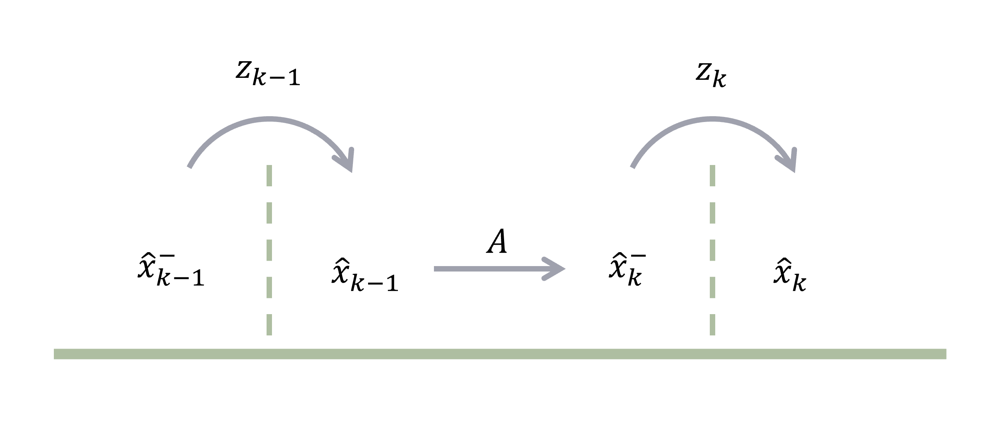

# Chapter6. 예측 과정
## 6.1. 예측값 계산 (계산 4단계 중 1단계)
예측 과정은 시각이 $t_k$에서 $t_{k+1}$로 바뀔 때 추정값($\hat{x}_k$)가 어떻게 바뀔지 추측하는 과정. 

$$
\begin{aligned}
\hat{x}_{k+1}^- &= A \hat{x}_k \qquad & \cdots ⓐ \\
P_{k+1}^- &= A P_{k} A^T + Q \qquad & \cdots ⓑ
\end{aligned}
$$

$\hat{x}_k$는 상태 변수 $\hat{x}$의 추정값, $\hat{x}_{k}^-$는 상태변수의 예측값이다. $P_k$는 오차 공분산의 계산값, $P_{k}^-$는 오차 공분산의 에측값이다.

## 6.2. 예측과 추정의 차이
칼만 필터에서는 직전 추정값($\hat{x}_{k-1}$)을 사용해 예측값($\hat{x}_{k}^-$)을 내고, 현재 추정값($\hat{x}_{k}$)을 계산할 때 그를 사용한다. 즉, 바로 추정값을 계산하지 않고 예측 단계를 거친다. 따라서 예측값을 '사전 추정값(a priori estimate)', 추정값을 '사후 추정값(posteriori estimate)'라고도 한다. 공분산 역시 같은 과정을 통해 계산한다.

같은 시각에 측정값으로 예측값을 계산하는 둥근 화살표가 '추정', 다음 시각으로 가며 행렬 A를 거치는 과정이 '예측'이다.

## 6.3. 추정값 계산식의 재해석
추정 과정에 해당하는 3단계 식은 아래와 같았다.

$$
\hat{x}_k = \hat{x}_{k}^- + K_k(z_k - H \hat{x}_k^-)
$$

여기서 $H \hat{x}_k^-$ 항은 예측값을 포함하고 있다. $z_k - H \hat{x}_k^-$는 곧 실제 측정값과 예측값의 차이를 말하며, 칼만 이득인 $K_k$을 곱해줌으로써 예측값을 얼마나 보정할지 결정한다. 즉, 추정식을 '예측값의 보정' 관점에서 볼 수 있고, 이는 곧 예측값을 잘 찾아내야지만 추정도 잘 할 수 있고, 그 과정에서 사용하는 칼만 이득을 선정하는 의미가 있어진다. 그러므로 예측 과정에서 사용되는 시스템 모델인 A, Q가 잘 정의되어야 예측값을 잘 찾을 수 있다.

